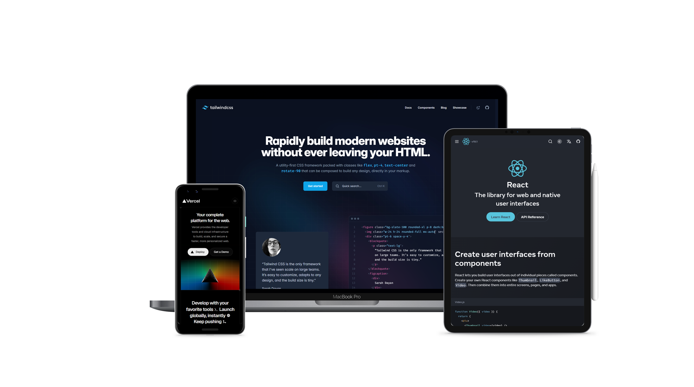

# SnapMock GitHub

<p align='center'>



</p>

**Automate device mockup screenshots in your GitHub workflows.**

SnapMock visits your deployed site, captures responsive screenshots inside device frames (like laptops), and automatically commits them to a branch of your choice. Perfect for keeping your README visuals or documentation up to date with every push.

## ✨ What This Does

When added to your workflow, SnapMock:

- Visits a given URL (e.g., your deployed site)
- Takes screenshots for specified device sizes
- Embeds them into realistic mockups (e.g., laptops)
- Saves the final images into a snapshots folder
- Lets you deploy or use those screenshots as needed (e.g., in a README, a docs site, or a branch)

---

## 🚀 Quick Start

1. **Add the Action** to your workflow (`.github/workflows/snapmock.yml`):

   ```yaml
    name: Run SnapMock

    on:
    schedule:
        - cron: "0 0 * * *"  # Every day at midnight
    push:
        branches: [main]
    workflow_dispatch:

    permissions:
        contents: write

    jobs:
        snapmock:
            runs-on: ubuntu-latest

            steps:
                - name: Checkout Repo
                    uses: actions/checkout@v3

                - name: Check current directory
                    run: |
                        echo "Current Directory:"
                        pwd  # Print the current directory

                - name: Ensure snapshots directory exists
                    run: |
                        run: mkdir -p ${{ github.workspace }}/<OUTPUT-DIR>  # Ensures the directory exists before SnapMock

                - name: Run SnapMock
                    uses: Programming-Sai/SnapMock@v1
                    with:
                        url: "https://your-live-site.com"
                        devices: "laptop,tablet,mobile"
                        output: "${{ github.workspace }}/<OUTPUT-DIR>" # Must be the same as the one specified above
                        selectors: ".dark-mode-toggle,.light-mode-toggle"  # Optional, Just for theme toggling

                - name: Debug snapshot output
                    run: |
                        echo "Snapshot output contents:"
                        ls -R ${{ github.workspace }}/<OUTPUT-DIR> || echo "No snapshots directory found"  # Debug if snapshots are present

                - name: Deploy to Custom Branch
                    uses: peaceiris/actions-gh-pages@v3
                    with:
                        github_token: ${{ secrets.GITHUB_TOKEN }}
                        publish_dir: ${{ github.workspace }}/<OUTPUT-DIR> # Correctly use the directory with the snapshots
                        publish_branch: <BRANCH-NAME>  # User-specified branch
                        commit_message: "Update SnapMock screenshots [skip ci]"
                    env:
                        GIT_AUTHOR_NAME: "SnapMock Bot"
                        GIT_AUTHOR_EMAIL: "snapmock@users.noreply.github.com"
   ```

2. \*\*Inspect your output branch. It should will contain files named:

   ```text
   output_<device>.png       # when no selectors

   OR

   output_<device>[_theme1|_theme2].png # with selectors
   ```

3. **Embed in your README**:
   ```markdown
   
   ```

---

## 🎚️ Inputs

| Name        | Required | Default                | Description                                                                                               |
| ----------- | -------- | ---------------------- | --------------------------------------------------------------------------------------------------------- |
| `url`       | ✓        | —                      | Full URL of the webpage to capture.                                                                       |
| `devices`   |          | `laptop,tablet,mobile` | Comma‑separated viewport(s). Valid: `laptop`, `tablet`, `mobile`.                                         |
| `output`    | ✓        | —                      | Workspace path where `snapshots/` will be created (e.g. `./snapshots`).                                   |
| `selectors` |          | (empty)                | Comma‑separated CSS selectors or XPaths to click before screenshot (theme toggles, dark or light themes). |

> **Note:** If `selectors` is omitted or empty, SnapMock captures a single screenshot per device.

---

## 📂 Output

- All images land in your specified **output directory** under `snapshots/`:

  - `output_laptop.png`
  - `output_tablet.png`
  - `output_mobile.png`
  - Or with `_theme1`/`_theme2` suffixes when toggles are provided.

- Those files are then published to your chosen branch (via the `peaceiris/actions-gh-pages` step), making them accessible at raw URLs like:
  ```
  https://raw.githubusercontent.com/OWNER/REPO/previews/snapshots/output_laptop.png
  ```

---
